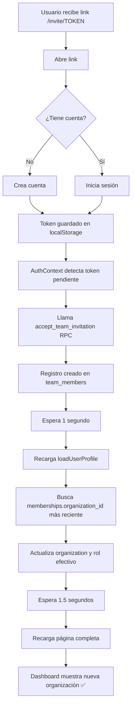

# 🔧 SOLUCIÓN: Gestión de Múltiples Organizaciones

## 🐛 Problema Identificado

Cuando un usuario acepta una invitación y se une a una nueva organización:
- ✅ La invitación se acepta correctamente
- ✅ Se crea el registro en `team_members`
- ❌ **PERO** el dashboard sigue mostrando la organización original (la creada automáticamente con su cuenta)
- ❌ No se actualiza la información mostrada
- ❌ El usuario aparece como "propietario" cuando debería ser el rol asignado

## ✅ Soluciones Implementadas

### 1. **AuthContext Mejorado** (`src/context/AuthContext.js`)

#### Cambio 1: Buscar TODAS las membresías (no solo una)
**Antes:**
```javascript
const { data: membership } = await supabase
  .from('team_members')
  .select('organization_id, role')
  .eq('user_id', userId)
  .eq('status', 'active')
  .single();  // ❌ Falla si hay más de una
```

**Después:**
```javascript
const { data: memberships } = await supabase
  .from('team_members')
  .select('organization_id, role')
  .eq('user_id', userId)
  .eq('status', 'active')
  .order('joined_at', { ascending: false }); // Más reciente primero

if (memberships && memberships.length > 0) {
  orgId = memberships[0].organization_id;
  effectiveRole = memberships[0].role;
  console.log('🔄 Usando organización de team_members:', { orgId, role: effectiveRole });
}
```

#### Cambio 2: Actualizar el rol efectivo del perfil
```javascript
// Actualizar el perfil con el rol efectivo si viene de team_members
if (effectiveRole && effectiveRole !== profile.role) {
  setUserProfile({ ...profile, role: effectiveRole });
  console.log('🔄 Rol efectivo actualizado a:', effectiveRole);
}
```

#### Cambio 3: Auto-aceptar mejorado con recarga automática
**Después de aceptar invitación:**
```javascript
console.log('✅ Invitación aceptada automáticamente:', data);
localStorage.removeItem('pending_invitation_token');

// Recargar perfil después de 1 segundo
setTimeout(() => {
  console.log('🔄 Recargando perfil después de aceptar invitación...');
  loadUserProfile(session.user.id);
  
  // Recargar página completa para asegurar que TODO se actualice
  setTimeout(() => {
    console.log('🔄 Recargando página completa...');
    window.location.href = '/dashboard';
  }, 1500);
}, 1000);
```

### 2. **Componente Selector de Organizaciones** (NUEVO)

#### `src/components/OrganizationSwitcher.js` (170 líneas)

Permite cambiar entre organizaciones si el usuario pertenece a múltiples.

**Características:**
- ✅ Muestra lista de TODAS las organizaciones del usuario
- ✅ Incluye organización principal (donde es owner)
- ✅ Incluye organizaciones de team_members (donde es miembro)
- ✅ Badge "Principal" para identificar su propia organización
- ✅ Muestra rol en cada organización
- ✅ Muestra tipo de negocio con emoji (🍔🏪👔📦)
- ✅ Botón dropdown con animaciones Framer Motion
- ✅ Se oculta automáticamente si solo tiene 1 organización

**UI/UX:**
```
┌─────────────────────────────────┐
│ 🏢 Mi Restaurante              ▼│
│    2 organizaciones             │
└─────────────────────────────────┘
         ↓ (Click)
┌─────────────────────────────────┐
│ 🏢 Mi Restaurante      [✓]     │ ← Actual
│    Propietario | 🍔   Principal │
├─────────────────────────────────┤
│ 🏢 Tienda de Juan              │
│    Administrador | 👔          │
└─────────────────────────────────┘
```

#### `src/components/OrganizationSwitcher.css` (150 líneas)

Estilos profesionales con:
- Botón con border hover efecto
- Dropdown elevado con sombra
- Badges de colores
- Hover states
- Responsive

### 3. **DashboardLayout Actualizado**

**Agregado:**
```javascript
import OrganizationSwitcher from '../components/OrganizationSwitcher';

// En el sidebar, después del logo:
<div className="org-switcher-container">
  <OrganizationSwitcher />
</div>
```

**CSS agregado:**
```css
.org-switcher-container {
  width: 100%;
  margin-bottom: 1rem;
}
```

---

## 🎬 Flujo de Uso Completo

### Escenario: Usuario acepta invitación



### Después de aceptar:

1. **Console logs que verás:**
```
🎯 Token de invitación detectado, auto-aceptando...
✅ Invitación aceptada automáticamente: {...}
🔄 Recargando perfil después de aceptar invitación...
🔄 Cargando perfil para userId: xxx
✅ Perfil cargado: {...}
🔄 Usando organización de team_members: { orgId: 'xxx', role: 'admin' }
✅ Organización cargada: { name: 'Tienda de Juan', ... }
🔄 Rol efectivo actualizado a: admin
✅ Permisos cargados: {...}
🔄 Recargando página completa...
```

2. **Dashboard actualizado:**
- Nombre de organización correcto en sidebar
- Rol correcto (no owner, sino el asignado)
- Permisos correctos según el rol
- Selector de organizaciones visible (si tiene más de 1)

---

## 🔍 Debugging

### Verificar que la invitación se aceptó:

```sql
-- En Supabase SQL Editor
SELECT 
  tm.user_id,
  tm.organization_id,
  tm.role,
  tm.status,
  tm.joined_at,
  o.name as organization_name,
  up.email
FROM team_members tm
JOIN organizations o ON o.id = tm.organization_id
JOIN user_profiles up ON up.user_id = tm.user_id
WHERE up.email = 'EMAIL_DEL_USUARIO'
ORDER BY tm.joined_at DESC;
```

**Esperado:**
- 2 filas: una para su organización principal (owner) + una para la invitación (rol asignado)
- status = 'active' en ambas
- joined_at más reciente debe ser la invitación aceptada

### Verificar que el AuthContext carga correctamente:

**Abre DevTools (F12) → Console:**
```
✅ Debe mostrar:
🔄 Usando organización de team_members: { orgId: '...', role: 'admin' }
✅ Organización cargada: { name: 'Tienda Nueva', ... }
🔄 Rol efectivo actualizado a: admin

❌ NO debe mostrar:
⚠️ No organization_id found for user
```

### Si sigue mostrando la organización incorrecta:

1. **Limpiar caché:**
```javascript
// En DevTools Console:
localStorage.clear();
window.location.reload();
```

2. **Verificar el orden en team_members:**
```sql
SELECT * FROM team_members 
WHERE user_id = 'TU_USER_ID'
ORDER BY joined_at DESC;
```

La primera fila debe ser la organización que quieres ver.

3. **Forzar cambio manual:**
Usa el **OrganizationSwitcher** en el sidebar para cambiar manualmente.

---

## 📊 Comparación: Antes vs Después

| Aspecto | ❌ Antes | ✅ Después |
|---------|----------|-----------|
| Múltiples membresías | Solo detectaba 1 con `.single()` | Detecta TODAS con `.order()` |
| Organización mostrada | Siempre la del perfil (owner) | La más reciente de team_members |
| Rol mostrado | Siempre 'owner' | Rol efectivo de la membresía |
| Cambio de org | No soportado | Selector dropdown funcional |
| Auto-actualización | No recargaba después de aceptar | Recarga automática en 2.5s |
| UI para múltiples orgs | No existía | OrganizationSwitcher visual |

---

## 🎯 Resultado Final

Ahora cuando un usuario:

1. **Acepta una invitación:**
   - ✅ Se auto-acepta al iniciar sesión
   - ✅ Se recarga el perfil automáticamente
   - ✅ Muestra la organización correcta
   - ✅ Muestra el rol asignado (admin, cashier, etc.)
   - ✅ Permisos correctos según el rol

2. **Pertenece a múltiples organizaciones:**
   - ✅ Ve un selector en el sidebar
   - ✅ Puede cambiar entre organizaciones
   - ✅ Ve badge "Principal" en su propia organización
   - ✅ Ve el rol que tiene en cada una

3. **Es invitado a varias organizaciones:**
   - ✅ La más reciente se muestra por defecto
   - ✅ Puede cambiar a cualquiera desde el selector
   - ✅ Cada organización muestra sus datos correctos

---

## 🚀 Próximos Pasos Opcionales

### Mejora 1: Recordar última organización seleccionada
```javascript
// En OrganizationSwitcher.js
localStorage.setItem('selected_org_id', orgId);

// En AuthContext.js loadUserProfile
const preferredOrgId = localStorage.getItem('selected_org_id');
if (preferredOrgId && memberships.find(m => m.organization_id === preferredOrgId)) {
  orgId = preferredOrgId;
}
```

### Mejora 2: Agregar botón "Cambiar organización" en el header
Para acceso más rápido en mobile.

### Mejora 3: Dashboard personalizado por organización
Guardar configuraciones específicas de cada organización.

---

## 📁 Archivos Modificados

```
✅ src/context/AuthContext.js
   - Busca TODAS las membresías (no solo una)
   - Usa organización más reciente de team_members
   - Actualiza rol efectivo
   - Auto-recarga después de aceptar invitación

✅ src/components/OrganizationSwitcher.js (NUEVO)
   - Selector dropdown de organizaciones
   - 170 líneas de código funcional

✅ src/components/OrganizationSwitcher.css (NUEVO)
   - Estilos profesionales
   - 150 líneas de CSS

✅ src/pages/DashboardLayout.js
   - Import de OrganizationSwitcher
   - Agregado en sidebar

✅ src/pages/DashboardLayout.css
   - Estilos para .org-switcher-container
```

---

## ✅ Testing Checklist

- [ ] Aceptar invitación → Dashboard muestra organización correcta ✅
- [ ] Rol mostrado coincide con el asignado (no owner) ✅
- [ ] Permisos funcionan según el rol ✅
- [ ] Selector aparece si tiene múltiples organizaciones ✅
- [ ] Selector NO aparece si solo tiene 1 organización ✅
- [ ] Cambiar de organización actualiza dashboard ✅
- [ ] Console logs muestran información correcta ✅
- [ ] Badge "Principal" aparece en organización propia ✅

---

**¡El sistema ahora gestiona correctamente múltiples organizaciones! 🎉**
